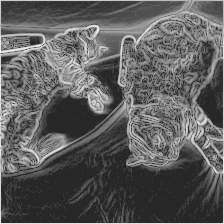

<h1 align="center">
  
</h1>
<a href="https://pypi.org/project/fsaa/" rel="nofollow"></a>
<a href="https://pypi.org/project/fsaa" rel="nofollow"></a>
<a href="https://github.com/BrianPulfer/fsaa" rel="nofollow"></a>


# FSAA: Feature Space Adversarial Attacks
FSAA allows to create adversarial examples that corrupt the features of the victim models. Various attacks are possible, by altering initialization and update strategies, losses and perceptual masks.
FSAA is written in Python and is based on PyTorch.
___


## Installation
If you would like to use `fsaa` in you project, simply run:
```bash
pip install fsaa
```
___

## Usage example
Here's a generic (and quite complete) [example](fsaa/examples/tutorial_normalizing_model.py) on how to use FSAA:

```python

```
Which results in an **image MSE of 0.0003**, a **feature Cosine Similarity of -0.8494**, and the following corruption:

<center>

| Original | Corrupted | JND Mask |
| :------: | :-------: | :------: |
|  |  | |

</center>

The library also comes with support for pre-trained SSL models from huggingface and other repositories:
```python
from fsaa.utils import get_model, SUPPORTED_MODELS

model = get_model("microsoft/beit-base-patch16-224").eval().to(device)
```
___

## Contributing
Contributions are highly welcome! Please refer to the [contributing guidelines](./CONTRIBUTING.md).
___
## License
The code is distributed according to the **Attribution-NonCommercial 4.0 International** [LICENSE](./LICENSE).
___

## Citation
If you used this library as part of your work, please cite the repository as follows:

```
@software{Pulfer_FSAA_2023,
author = {Pulfer, Brian},
month = jul,
title = {{FSAA}},
url = {https://github.com/BrianPulfer/fsaa},
version = {0.1.0},
year = {2023}
}
```
___

## Acknowledgements
Part of the code was taken and adapted from the following repositories:
  - [facebookresearch/active_indexing](https://github.com/facebookresearch/active_indexing)
    - JND masking
